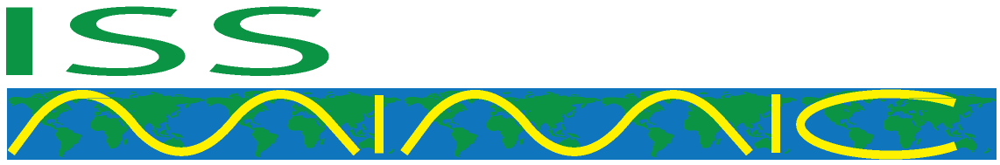

<!-- =========================================================
  ISS Mimic  •  Re-create the ISS attitude & telemetry in real-time
  ========================================================= -->

<p align="center">
  
</p>

<p align="center">
  <a href="https://opensource.org/licenses/MIT"></a>
  
  <a href="https://discord.gg/zPKyE6hBSe"></a>
  <a href="https://www.youtube.com/watch?v=W9iZBjzOEEQ"></a>
</p>

> **ISS Mimic** is an open-source mash-up of hardware + software that **mirrors the International Space Station’s solar-array and radiator motion** in real time.  
> Runs on Raspberry Pi • 12 motors drive a 3-D printed ISS • Live telemetry visualizer

---

ISS Mimic is a 3D printed model of the International Space Station that connects to the actual live data from the real ISS to control a model that rotates solar panels and radiators to match the real one in real time. The goal of this project is to connect people with the ISS. There are three different mimic models: Mimic, Mini Mimic, and Edu Mimic. These models are designed for teachers, students, museums, hobbyists, and anyone who wants to learn more about the ISS. 

Join the discussion, help out, ask for help, chat about the ISS here: [Mimic Discord](https://discord.gg/zPKyE6hBSe)


<details>
<summary>Table of Contents</summary>

- [Features](#features)
- [Quick Start (Raspberry Pi)](#quick-start-raspberry-pi)
- [Project Architecture](#project-architecture)
- [Build Your Own Model](#build-your-own-model)
- [Screenshots](#screenshots)
- [Contributing](#contributing)
- [Roadmap](#roadmap)
- [License](#license)
</details>

---

### Features
- **Live telemetry pull** from NASA’s Lightstreamer endpoint – no scraping needed  
- **Interactive dashboards** (more capable than the original ISSLive site)  
- **Real-time kinematics**: 12-axis motion matches α- and β-gimbal joint angles  
- **Modular design**: Separate Pi (telemetry & UI) ↔ Arduino (motor control)  
- **Low- / High-fidelity STLs** you can print today  

### Quick Start (Raspberry Pi)
```bash
# 1. Clone & install deps
  git clone --depth 1 https://github.com/ISS-Mimic/Mimic.git/ 
  cd ~/Mimic
  python setup.py

# 2. Run the Mimic GUI dashboard
  cd ~/Mimic/Pi/
  python GUI.py
```
Full software guide: [Wiki » Software Setup Instructions](https://github.com/ISS-Mimic/Mimic/wiki/Build-Instruction%3A-Mimic-Software-Setup-Instructions).

### Telemetry
Telemetry is data remotely collected from the ISS and transmitted to the ISS Mission Control Centers for monitoring the operational status of ISS systems. 

In 2011 some incredible JSC employees released a subset of the 100,000+ ISS telemetry items to the public under the ISSlive! project and an associated website.
Sadly, that website is no longer running, but they opened the door for dozens of projects to follow in their footsteps. 

NASA contracted the wonderful folks at [Lightstreamer](https://lightstreamer.com/) to provide this subset of ISS telemetry out to the public and that is the source of all the public telemetry projects today. 

We have made three telemetry pages to show off all of the public data (as well as our Pi application screens).

A filterable table here: https://iss-mimic.github.io/Mimic/ (and in Russian: https://iss-mimic.github.io/Mimic/index_ru.html)
and a great dashboard here: https://iss-mimic.github.io/Mimic/dashboard.html

### Project Architecture
```text
┌──────────┐              ┌──────────────┐                ┌──────────────┐                 ┌──────────┐
│ NASA LS  │────────────▶│ Raspberry Pi │───────────────▶│  Arduino(s)  │───────────────▶│  Motors  │
└──────────┘  telemetry   └──────────────┘  joint angles  └──────────────┘  motor commands └──────────┘
```
*Pi side* (Python + Kivy) shows telemetry dashboards and forwards joint targets.  
*Arduino side* (C++) drives stepper/servo motors in the 3-D-printed truss.

### Build Your Own Model
| Fidelity | STL pack | Status |
|----------|----------|--------|
| Low      | [`/3D_Printing`](3D_Printing) | ✔ Complete |
| High     | `/3D_Printing/high_fidelity` | In progress – contributors welcome! |

Mechanical details, BOM, and wiring live in the **[Hardware Wiki section](https://github.com/ISS-Mimic/Mimic/wiki/Hardware)**.

### Screenshots
<p align="center">
  
  
  
  <br>
  
  
  
  <br>
  
  
  
</p>

### Contributing
Start by opening an issue to suggest am improvement or bug or by chatting on **[Discord](https://discord.gg/zPKyE6hBSe)**.  
Coding guidelines:
1. Follow **PEP 8** and keep GUI layout in **`.kv` files** (Kivy best practice).  
2. Fix all our mistakes. 

Other help:
-Feel free to suggest ideas! Best place to talk is out discord, or feel free to publish an issue

### Roadmap
- [ ] Finish high-fidelity CAD & release STEP source
- [ ] Complete build guide
- [ ] Finish Kivy telemetry screens  

### License
This project is licensed under the MIT License – see [`LICENSE`](LICENSE) for details.

<details>
<summary>The code is ugly and awful but it works *mostly* (click to vent)</summary>

We’re hardware engineers moonlighting as coders. Expect caffeine-driven hacks and the occasional refactor fiasco. Contributions and constructive feedback are *super* welcome!
</details>
